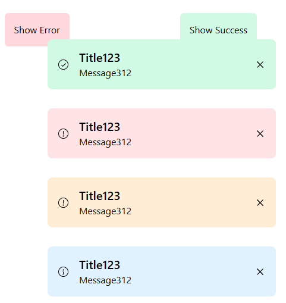

# :sparkles: SimpleToast

Simple toast notification library with Tailwind CSS.

**This means TailwindCSS is required! for this to work "out of the box"**

## :arrow_heading_down: Installation

Simply include the [SimpleToast.js](./SimpleToast.js) or [SimpleToast.min.js](./SimpleToast.min.js) file.

Or, you can also link it via JsDelivr:
```html
<script src="https://cdn.jsdelivr.net/gh/itaypanda/simpletoast@master/SimpleToast.min.js"></script>
```

## :memo: Change Log

<<<<<<< HEAD
- **August 25th** -  rewrote some of the code and made it easier to customize, also code is now smaller. - [#1](https://github.com/itaypanda/SimpleToast/issues/1)

- **November 2nd** - added a JsDelivr link, updated a usage instruction renamed some files to demo, updated and made README a little nicer.
=======
- 25th August rewrote some of the code and made it easier to customize, also code is now smaller. - [#1](https://github.com/itaypanda/SimpleToast/issues/1)
>>>>>>> e59ed157ecd9e832cdb683119a7c86c2b8512f51

## :gear: Config

No configuration is required unless you count the init and the toast itself.

## :fire: Usage

```javascript

// Init the library onto the page, can be skipped if you add:
// <div id="alertBox" class="fixed bottom-0 right-0 z-[9999]"></div>
// Anywhere in the page, recommended at the top or bottom
toastInit();

// Example info toast:

toast('Title', 'Message', toastStyles.info);

// Example warn toast:

toast('Title', 'Message', toastStyles.warn);

// Example error toast:

toast('Title', 'Message', toastStyles.error);

// Example success toast:

toast('Title', 'Message', toastStyles.success);


// Example toast with set fade time 10 seconds instead of the default (7.5 seconds):

toast('Title', 'Message', toastStyles.info, 10);

```

## :wrench: Adding custom styles

```javascript
// Defining the style
const toastStyles = {
  // ...
  customStyle: {
    color: "blue", // Tailwind CSS color. Ex: [#ffffff].
    icon: "<svg></svg>" // Doesn't have to be an svg.
  },
}

// Using it
toast('Title', 'Message', toastStyles.customStyle);
```

Recommended svg/img size: 21x21

## :computer: Demo

You can open the [demo.html](./demo.html) file to view a demo page of the library:



## :wave: Contact/Contribute

Open an issue and I'll answer as soon as I'm available.

Feel free to contribute :D

Feel free to open an issue if you find any, or if you want to add a feature!

## :page_with_curl: License

This project is licensed under the [MIT license.](./LICENSE)

>Copyright (c) 2023 itaypanda
>
> Permission is hereby granted, free of charge, to any person obtaining a copy of this software and associated documentation files (the "Software"), to deal in the Software without restriction, including without limitation the rights to use, copy, modify, merge, publish, distribute, sublicense, and/or sell copies of the Software, and to permit persons to whom the Software is furnished to do so, subject to the following conditions:
>
> The above copyright notice and this permission notice shall be included in all copies or substantial portions of the Software.
>
> THE SOFTWARE IS PROVIDED "AS IS", WITHOUT WARRANTY OF ANY KIND, EXPRESS OR IMPLIED, INCLUDING BUT NOT LIMITED TO THE WARRANTIES OF MERCHANTABILITY, FITNESS FOR A PARTICULAR PURPOSE AND NONINFRINGEMENT. IN NO EVENT SHALL THE AUTHORS OR COPYRIGHT HOLDERS BE LIABLE FOR ANY CLAIM, DAMAGES OR OTHER LIABILITY, WHETHER IN AN ACTION OF CONTRACT, TORT OR OTHERWISE, ARISING FROM, OUT OF OR IN CONNECTION WITH THE SOFTWARE OR THE USE OR OTHER DEALINGS IN THE SOFTWARE.

## :blue_heart: Thanks

**Thanks to Tailwind CSS / Tailwind Labs, Inc.**

https://github.com/tailwindlabs/tailwindcss/blob/master/LICENSE

https://github.com/tailwindlabs/tailwindcs

https://tailwindcss.com/

**Thanks to system UIcons**

https://github.com/CoreyGinnivan/system-uicons/blob/main/LICENSE

https://github.com/CoreyGinnivan/system-uicons

https://www.systemuicons.com/
